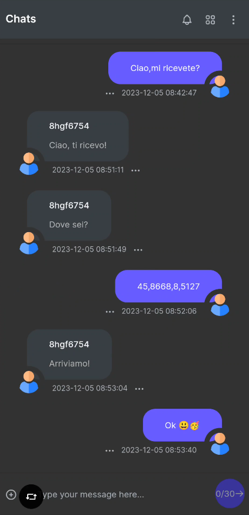
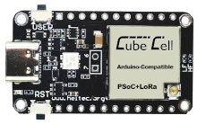
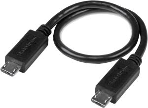

**LoRa**

 

LoRa (Long Range) è una tecnologia basata sulla modulazione di frequenza a spettro espans derivata dalla tecnologia Chirp Spread Spectrum (CSS). Rappresenta la prima implementazione a basso costo dello spettro di diffusione chirp per uso commerciale.

- ## **Descrizione**
**LoRa Mobile App** è un'applicazione di **Chat Real Time** basata su LoRa che consente agli utenti di inviare e ricevere messaggi istantanei tra loro o in un'unica Chat Room.  

Nel contesto di questo progetto, utilizziamo la scheda di sviluppo ***CubeCell – AB01 Dev-Board*** in modalità ***AT Command*** per consentire l'interazione con uno Smartphone e avviare lo scambio di dati tramite frequenze radio. L'applicazione permette di avviare semplici conversazioni testuali per comunicare con altri utenti nel raggio LoRa. 
Uno degli obiettivi principali di questo progetto è semplificare l'utilizzo della tecnologia LoRa, rendendola accessibile a tutti e agevolando una comunicazione bidirezionale punto-punto.
**N.B. Per garantire un corretto funzionamento, è essenziale che la scheda contenga il codice sorgente disponibile dagli esempi ufficiali forniti da Heltec Cube Cell.  

- ## Step By Step
1. [Prerequisiti](#prerequisiti) 
2. [Preparazione del dispositivo](#preparazione) 
3. [Configurazione dell'appliczione](#configurazione) 
4. [Pro & Contro](#proecontro) 
5. [Curiosità](#curiosità) 
6. [Supporto](#supporto) 
   
- # 1.Prerequisiti

**Versione Android**: 13 o successiva. 
**Spazio di archiviazione**: Minimo 16.6 MB. 
**Memoria RAM**: Consigliato 2 GB o superiore. 
**CubeCell – AB01 Dev-Board**: Scheda di sviluppo Heltec. 
**Cavo USB**: Cavo USB per collegare la scheda allo Smartphone.

## Dove acquistare *CubeCell – AB01 Dev-Board?
 
*CubeCell – AB01 Dev-Board* 
[Heltec](https://heltec.org/project/htcc-ab01-v2/)|[Amazon](https://www.amazon.it/LoRaWAN-sviluppo-ASR6501-energetico-Intelligent/dp/B07ZH7NL38/ref=sr_1_1?__mk_it_IT=%C3%85M%C3%85%C5%BD%C3%95%C3%91&crid=2E73JV8F1KPLV&keywords=heltec+cubecell&qid=1701754977&sprefix=heltec+cubecel%2Caps%2C148&sr=8-1)|[Aliexpress](https://it.aliexpress.com/item/1005005444339915.html?spm=a2g0o.productlist.main.3.1d7150b2TFr0YZ&algo_pvid=b9b676a0-1f19-4aaf-807d-e712d7758b64&algo_exp_id=b9b676a0-1f19-4aaf-807d-e712d7758b64-1&pdp_npi=4%40dis%21EUR%2116.48%2116.48%21%21%2117.45%21%21%402103209b17017550135711815e8815%2112000033106113757%21sea%21IT%210%21AB&curPageLogUid=SzqEk2lL0gTd) 

## Cavi USB compatibili?
 *USB Type-C/Micro USB* 
 *USB Type-C/Micro USB* 

- # 2.Preparazione del dispositivo 

[Istruzioni via Arduino Board Manager](https://docs.heltec.org/en/node/asr650x/htcc_ab01/quick_start.html#use-arduino-board-manager) 
[Istruzioni via Git](https://docs.heltec.org/en/node/asr650x/htcc_ab01/quick_start.html#via-git) 
[Istruzioni via File Locale](https://docs.heltec.org/en/node/asr650x/htcc_ab01/quick_start.html#via-local-file) 

- # 3.Configurazione dell'applicazione 

**1 - Scaricare l'applicazione dall'ultima release disponibile.**  
**2 - Collegare la Dev-Board allo Smartphone tramite cavo USB.**  
**3 - Configurare la frequenza disponibile nel proprio paese tramite il pannello di configurazione.**  
**3 - Inizia a chattare!**  

- # **4.Pro & Contro**
| **Pro**                                       | **Contro**                                              |
|-----------------------------------------------|----------------------------------------------------------|
| Ampia copertura                               | Banda limitata                                           |
| Basso consumo energetico                       | Velocità di trasmissione limitata                         |
| Penetrazione di ostacoli                       | Interferenze                                             |
| Costi ridotti                                  | Sicurezza                                                |
| Versatilità delle applicazioni                 | Limitazioni dei pacchetti dati                            |

- # **5.Curiosità**
1. LoRa sfrutta bande di radiofrequenza sub-gigahertz come 433 MHz, 868 MHz (Europa) e 915 MHz (Nord America).
2. Garantisce trasmissioni a lungo raggio (oltre 10 km in zone rurali, 3–5 km in zone fortemente urbanizzate) con basso consumo energetico.
3. Si compone di due parti: LoRa, lo strato fisico, e LoRaWAN (Long Range Wide Area Network), gli strati superiori.
4. I nuovi chipset LoRa presentano consumi energetici ridotti, maggiore potenza di trasmissione e dimensioni più compatte rispetto alle generazioni precedenti.
5. Dispone di funzionalità di geolocalizzazione per triangolare le posizioni dei dispositivi tramite timestamp dai gateway.
6. Consente la connettività a lungo raggio per dispositivi Internet of Things (IoT) in diversi settori.
7. Riferimento al PDF dei comandi AT: [Manuale Utente Comandi AT](https://resource.heltec.cn/download/CubeCell/AT_Command_list/CubeCell_Series_AT_Command_User_Manual_V0.4.pdf)

- # **6.Supporto**
Per eventuali domande, segnalazioni di bug o richieste di nuove funzionalità, ti invitiamo ad aprire una nuova issue nel nostro repository su GitHub. Cercheremo di rispondere nel più breve tempo possibile. 
Per domande più urgenti o altri problemi, puoi contattarci via email all'indirizzo davide.polli@dedem.it. Ti preghiamo di includere dettagli completi sul problema riscontrato per una risoluzione più rapida. 
Siamo impegnati a migliorare continuamente l'applicazione e apprezziamo ogni contributo e feedback dalla nostra community. 

