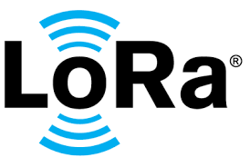
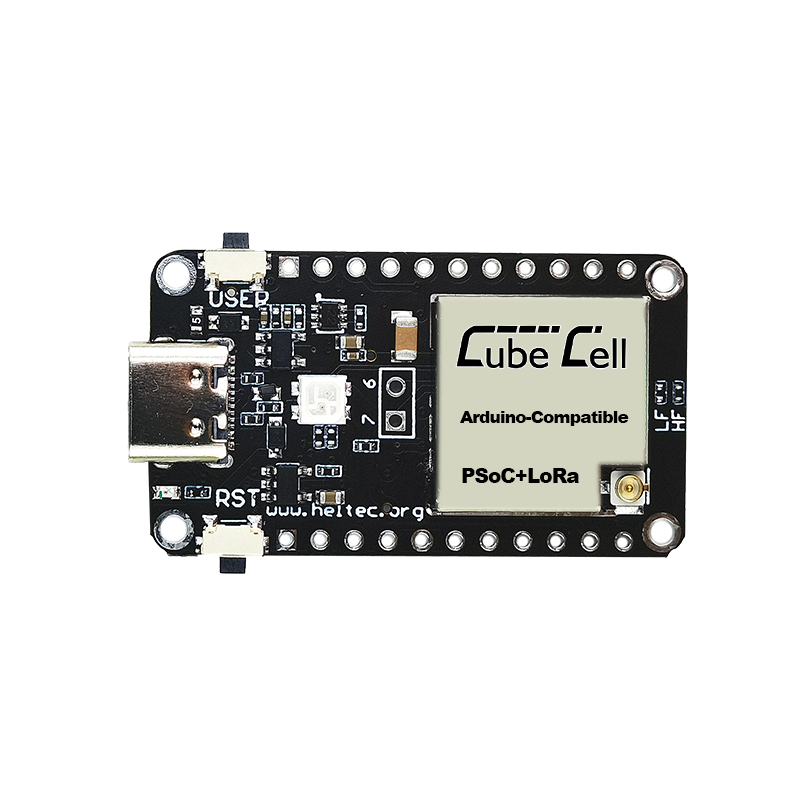

# LoRa Mobile App

## English

**LoRa**

LoRa (Long Range) technology is based on spread spectrum frequency modulation derived from Chirp Spread Spectrum (CSS). It represents the first low-cost implementation of chirp spread spectrum for commercial use. Initially developed by Cycleo in Grenoble, France, it was acquired by Semtech in 2012 and became a founding member of the LoRa Alliance.

**Description**

Semtech manufactures LoRa devices. The Long Range wireless radio frequency technology (LoRa) is a low-power, long-range wireless chipset used in implementing numerous Internet of Things (IoT) networks worldwide. It competes with other low-power wireless networks (LPWAN) such as Narrowband IoT (NB IoT), LTE Cat M1, SigFox, and Ingenu.

**Key Features**

- LoRa operates on sub-gigahertz radio frequency bands like 433 MHz, 868 MHz (Europe), and 915 MHz (North America).
- Enables long-range transmissions (over 10 km in rural areas, 3–5 km in heavily urbanized areas) with low energy consumption.
- Comprises two parts: LoRa, the physical layer, and LoRaWAN (Long Range Wide Area Network), the upper layers.
- New LoRa chipsets offer reduced energy consumption, increased transmission power, and smaller sizes compared to previous generations.
- Features geolocation capabilities used to triangulate device positions via timestamps from gateways.
- Enables long-range connectivity for Internet of Things (IoT) devices across various industries.

## Italiano

**LoRa**

LoRa (Long Range) è una tecnologia basata sulla modulazione di frequenza a spettro espans derivata dalla tecnologia Chirp Spread Spectrum (CSS). Rappresenta la prima implementazione a basso costo dello spettro di diffusione chirp per uso commerciale.

**Descrizione**

In questo progetto utilizziamo la Dev-Board **CubeCell – AB01 Dev-Board** in modalità AT Command al fine di comunicare con lo Smartphone e avviare lo scambio di dati. La scheda deve necessariamente essere flashata con il sorgente scaricabile dal seguente link: LINK.
L'applicazione permette di avviare chat testuali bi-direzionali con tutti gli altri utilizzatori, disponibili nel campo LoRa.

Nella versione attuale del progetto la Dev-Board viene collegata allo Smartphone tramite USB: FOTO.

**Pro**
Distanza di utilizzo
Basso costo

**Contro**
Lunghezza massima dei dati di trasferimento

Riferimento al PDF dei comandi AT:
https://resource.heltec.cn/download/CubeCell/AT_Command_list/CubeCell_Series_AT_Command_User_Manual_V0.4.pdf

**Caratteristiche Principali**

- LoRa sfrutta bande di radiofrequenza sub-gigahertz come 433 MHz, 868 MHz (Europa) e 915 MHz (Nord America).
- Garantisce trasmissioni a lungo raggio (oltre 10 km in zone rurali, 3–5 km in zone fortemente urbanizzate) con basso consumo energetico.
- Si compone di due parti: LoRa, lo strato fisico, e LoRaWAN (Long Range Wide Area Network), gli strati superiori.
- I nuovi chipset LoRa presentano consumi energetici ridotti, maggiore potenza di trasmissione e dimensioni più compatte rispetto alle generazioni precedenti.
- Dispone di funzionalità di geolocalizzazione per triangolare le posizioni dei dispositivi tramite timestamp dai gateway.
- Consente la connettività a lungo raggio per dispositivi Internet of Things (IoT) in diversi settori.
