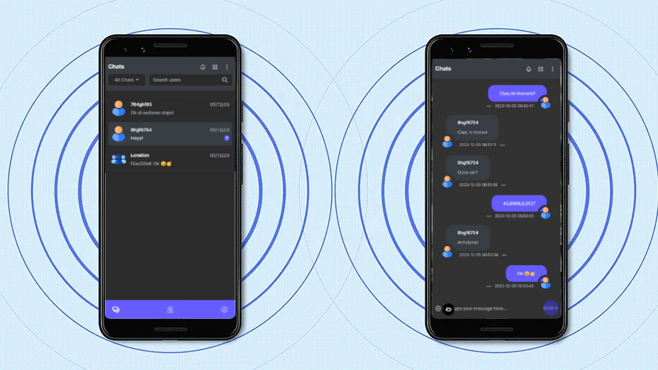

**LoRa**

  
LoRa (Long Range) is a technology based on frequency modulation with spread spectrum derived from Chirp Spread Spectrum (CSS) technology. It represents the first low-cost implementation of the chirp spread spectrum for commercial use." 

- ## **Description**
**LoRa Mobile App** is a Real-Time Chat application based on LoRa, allowing users to send and receive instant messages either privately or in a single Chat Room. 
  

In the context of this project, we use the **CubeCell – AB01 Dev-Board development board** in **AT Command** mode to enable interaction with a smartphone and initiate data exchange via radio frequencies. The application allows initiating simple text conversations to communicate with other users within the LoRa range. One of the main objectives of this project is to simplify the use of LoRa technology, making it accessible to everyone and facilitating bidirectional point-to-point communication.
**Note: To ensure proper functionality, it is essential that the board contains the source code available from the official examples provided by Heltec Cube Cell**. 

- ## Step By Step
1. [Prerequisites](#prerequisites) 
2. [Device Preparation](#device-preparation) 
3. [Application Configuration](#application-configuration) 
4. [Pros & Cons](#pros-and-cons) 
5. [Curiosities](#curiosities) 
6. [Support](#support) 
   
- # 1. Prerequisites 

**Android Version**: 13 or later. 
**Storage Space**: Minimum 16.6 MB. 
**RAM**: Recommended 2 GB or higher. 
**CubeCell – AB01 Dev-Board**: Heltec development board. 
**USB Cable**: USB cable to connect the board to the Smartphone.

## Where to Buy CubeCell – AB01 Dev-Board?
 
*CubeCell – AB01 Dev-Board* 
[Heltec](https://heltec.org/project/htcc-ab01-v2/)|[Amazon](https://www.amazon.it/LoRaWAN-sviluppo-ASR6501-energetico-Intelligent/dp/B07ZH7NL38/ref=sr_1_1?__mk_it_IT=%C3%85M%C3%85%C5%BD%C3%95%C3%91&crid=2E73JV8F1KPLV&keywords=heltec+cubecell&qid=1701754977&sprefix=heltec+cubecel%2Caps%2C148&sr=8-1)|[Aliexpress](https://it.aliexpress.com/item/1005005444339915.html?spm=a2g0o.productlist.main.3.1d7150b2TFr0YZ&algo_pvid=b9b676a0-1f19-4aaf-807d-e712d7758b64&algo_exp_id=b9b676a0-1f19-4aaf-807d-e712d7758b64-1&pdp_npi=4%40dis%21EUR%2116.48%2116.48%21%21%2117.45%21%21%402103209b17017550135711815e8815%2112000033106113757%21sea%21IT%210%21AB&curPageLogUid=SzqEk2lL0gTd) 

## Compatible USB Cables?
 *USB Type-C/Micro USB* 
 *USB Type-C/Micro USB* 

- # 2. Device Preparation 

**1 - Setting Up the Environment** 
Method 1: [Instructions via Arduino Board Manager](https://docs.heltec.org/en/node/asr650x/htcc_ab01/quick_start.html#use-arduino-board-manager) **<--Recommended** 
Method 2: [Instructions via Git](https://docs.heltec.org/en/node/asr650x/htcc_ab01/quick_start.html#via-git) 
Method 3: [Instructions via Local File](https://docs.heltec.org/en/node/asr650x/htcc_ab01/quick_start.html#via-local-file) 

**2 - Flashing the Device** 
In Arduino IDE, select **Files** --> **Examples** --> **LoRa** --> **AT_Command**, then click **Verify & Upload**. 
Ensure that the source matches this: [AT_Command.ino](https://github.com/HelTecAutomation/CubeCell-Arduino/blob/master/libraries/LoRa/examples/AT_Command/AT_Command.ino) 

- # 3. Application Configuration 

**1 - Download the application from the latest available release.**  
**2 - Connect the Dev-Board to the Smartphone via USB cable.**  
**3 - Configure the available frequency in your country using the configuration panel.**  
**4 - Start chatting!**  

- # **4. Pros & Cons**
| **Pros**                                      | **Cons**                                                |
|-----------------------------------------------|----------------------------------------------------------|
| Wide coverage                                 | Limited bandwidth                                        |
| Low power consumption                         | Limited transmission speed                               |
| Obstacle penetration                          | Interference                                             |
| Reduced costs                                 | Security concerns                                        |
| Application versatility                       | Data packet limitations                                  |

- # **5. Curiosities**
1. LoRa utilizes sub-gigahertz radio frequency bands such as 433 MHz, 868 MHz (Europe), and 915 MHz (North America).
2. It ensures long-range transmissions (over 10 km in rural areas, 3–5 km in highly urbanized zones) with low power consumption.
3. It consists of two parts: LoRa, the physical layer, and LoRaWAN (Long Range Wide Area Network), the upper layers.
4. New LoRa chipsets feature reduced power consumption, increased transmission power, and smaller sizes compared to previous generations.
5. It offers geolocation capabilities to triangulate device positions using timestamps from gateways.
6. Provides long-range connectivity for Internet of Things (IoT) devices across various sectors.
7. Reference to [AT Command User Manual](https://resource.heltec.cn/download/CubeCell/AT_Command_list/CubeCell_Series_AT_Command_User_Manual_V0.4.pdf)
8. Reference to [Understanding LoRa](https://development.libelium.com/lora_networking_guide/understanding-lora)

- # **6. Support**
For any questions, bug reports, or feature requests, please open a new issue in our GitHub repository. We will strive to respond as quickly as possible.
For more urgent inquiries or other issues, you can contact us via email at davide.polli@dedem.it. Please include complete details about the encountered problem for a faster resolution.
We are committed to continually improving the application and value every contribution and feedback from our community.

