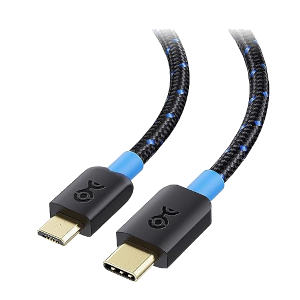

**LoRa**

  
LoRa (Long Range) is a technology based on frequency modulation with spread spectrum derived from Chirp Spread Spectrum (CSS) technology. It represents the first low-cost implementation of the chirp spread spectrum for commercial use." 

- ## **Description**
**LoRa Mobile App** is a Real-Time Chat application based on LoRa, allowing users to send and receive instant messages either privately or in a single Chat Room. 

In the context of this project, we use the **CubeCell – AB01 Dev-Board development board** in **AT Command** mode to enable interaction with a smartphone and initiate data exchange via radio frequencies. The application allows initiating simple text conversations to communicate with other users within the LoRa range. One of the main objectives of this project is to simplify the use of LoRa technology, making it accessible to everyone and facilitating bidirectional point-to-point communication.
**Note: To ensure proper functionality, it is essential that the board contains the source code available from the official examples provided by Heltec Cube Cell**. 

- ## Step By Step
1. [Prerequisites](#prerequisites) 
2. [Device Preparation](#device-preparation) 
3. [Application Configuration](#application-configuration) 
4. [Pros & Cons](#pros-and-cons) 
5. [Curiosities](#curiosities) 
6. [Support](#support) 
   
- # 1. Prerequisites 

**Android Version**: 13 or later. 
**Storage Space**: Minimum 16.6 MB. 
**RAM**: Recommended 2 GB or higher. 
**CubeCell – AB01 Dev-Board**: Heltec development board. 
**USB Cable**: USB cable to connect the board to the Smartphone.

## Dove acquistare CubeCell – AB01 Dev-Board?
 
*CubeCell – AB01 Dev-Board* 
[Heltec](https://heltec.org/project/htcc-ab01-v2/)|[Amazon](https://www.amazon.it/LoRaWAN-sviluppo-ASR6501-energetico-Intelligent/dp/B07ZH7NL38/ref=sr_1_1?__mk_it_IT=%C3%85M%C3%85%C5%BD%C3%95%C3%91&crid=2E73JV8F1KPLV&keywords=heltec+cubecell&qid=1701754977&sprefix=heltec+cubecel%2Caps%2C148&sr=8-1)|[Aliexpress](https://it.aliexpress.com/item/1005005444339915.html?spm=a2g0o.productlist.main.3.1d7150b2TFr0YZ&algo_pvid=b9b676a0-1f19-4aaf-807d-e712d7758b64&algo_exp_id=b9b676a0-1f19-4aaf-807d-e712d7758b64-1&pdp_npi=4%40dis%21EUR%2116.48%2116.48%21%21%2117.45%21%21%402103209b17017550135711815e8815%2112000033106113757%21sea%21IT%210%21AB&curPageLogUid=SzqEk2lL0gTd) 

## Cavi USB compatibili?
 *USB Type-C/Micro USB* 
 *USB Type-C/Micro USB* 

- # 2.Preparazione del dispositivo 

[Istruzioni via Arduino Board Manager](https://docs.heltec.org/en/node/asr650x/htcc_ab01/quick_start.html#use-arduino-board-manager) 
[Istruzioni via Git](https://docs.heltec.org/en/node/asr650x/htcc_ab01/quick_start.html#via-git) 
[Istruzioni via File Locale](https://docs.heltec.org/en/node/asr650x/htcc_ab01/quick_start.html#via-local-file) 

- # 3.Configurazione dell'applicazione 

**1 - Scaricare l'applicazione dall'ultima release disponibile.**  
**2 - Collegare la Dev-Board allo Smartphone tramite cavo USB.**  
**3 - Configurare la frequenza disponibile nel proprio paese tramite il pannello di configurazione.**  
**3 - Inizia a chattare!**  

- # **4.Pro & Contro**
| **Pro**                                       | **Contro**                                              |
|-----------------------------------------------|----------------------------------------------------------|
| Ampia copertura                               | Banda limitata                                           |
| Basso consumo energetico                       | Velocità di trasmissione limitata                         |
| Penetrazione di ostacoli                       | Interferenze                                             |
| Costi ridotti                                  | Sicurezza                                                |
| Versatilità delle applicazioni                 | Limitazioni dei pacchetti dati                            |

- # **5.Curiosità**
1. LoRa sfrutta bande di radiofrequenza sub-gigahertz come 433 MHz, 868 MHz (Europa) e 915 MHz (Nord America).
2. Garantisce trasmissioni a lungo raggio (oltre 10 km in zone rurali, 3–5 km in zone fortemente urbanizzate) con basso consumo energetico.
3. Si compone di due parti: LoRa, lo strato fisico, e LoRaWAN (Long Range Wide Area Network), gli strati superiori.
4. I nuovi chipset LoRa presentano consumi energetici ridotti, maggiore potenza di trasmissione e dimensioni più compatte rispetto alle generazioni precedenti.
5. Dispone di funzionalità di geolocalizzazione per triangolare le posizioni dei dispositivi tramite timestamp dai gateway.
6. Consente la connettività a lungo raggio per dispositivi Internet of Things (IoT) in diversi settori.
7. Riferimento al PDF dei comandi AT: [Manuale Utente Comandi AT](https://resource.heltec.cn/download/CubeCell/AT_Command_list/CubeCell_Series_AT_Command_User_Manual_V0.4.pdf)

- # **6.Supporto**
Per eventuali domande, segnalazioni di bug o richieste di nuove funzionalità, ti invitiamo ad aprire una nuova issue nel nostro repository su GitHub. Cercheremo di rispondere nel più breve tempo possibile. 
Per domande più urgenti o altri problemi, puoi contattarci via email all'indirizzo davide.polli@dedem.it. Ti preghiamo di includere dettagli completi sul problema riscontrato per una risoluzione più rapida. 
Siamo impegnati a migliorare continuamente l'applicazione e apprezziamo ogni contributo e feedback dalla nostra community. 

